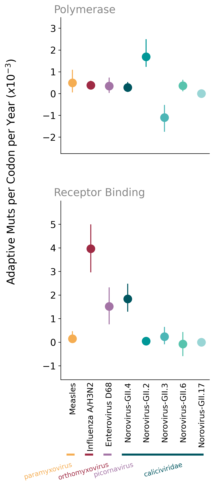
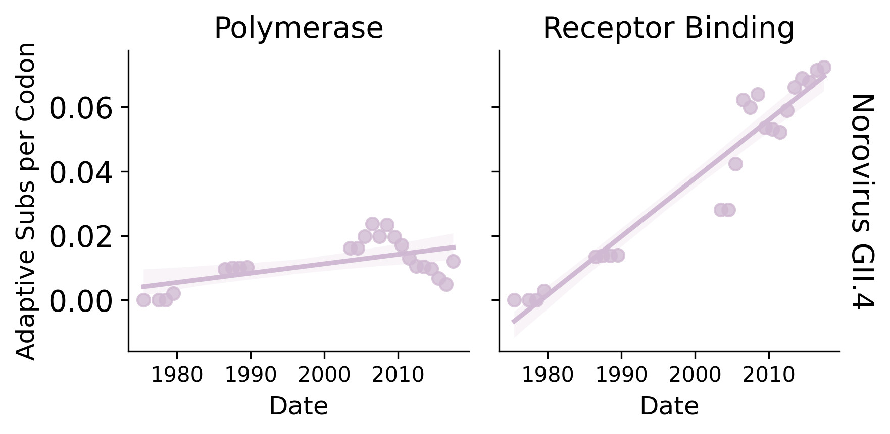
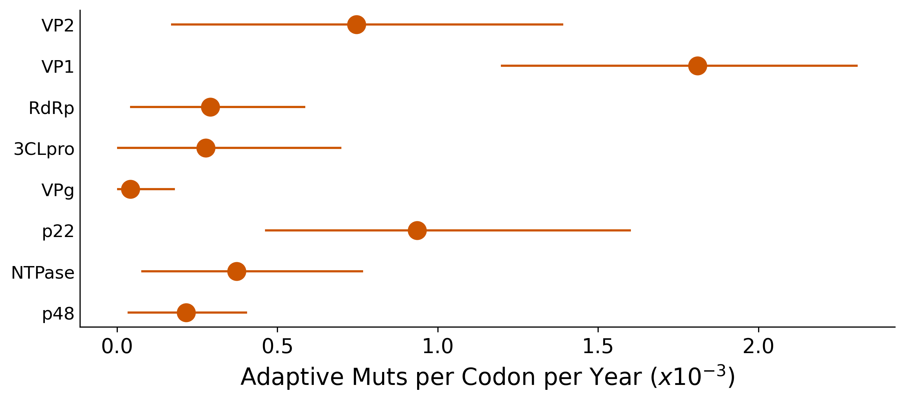

# Norovirus
Nextstrain analysis of Norovirus - this repository analyzes viral genomes using Nextstrain to understand how Norovirus evolves and spreads.

## Introduction
This is the [Nextstrain build for Norovirus](https://nextstrain.org/community/blab/norovirus/all/genome). The build encompasses fetching data, preparing it for analysis, doing quality control, performing analyses, and saving the results in a format suitable for visualization (with auspice). This involves running components of Nextstrain such as augur.

### Installations
[Miniconda](https://docs.conda.io/en/latest/miniconda.html) and mamba are required to run the workflow. After installing Miniconda, install mamba using:

`conda install mamba -n base -c conda-forge`

### Creating an Environment
Create an environment to test this Nextstrain workflow.

`mamba env create -n nextstrain-norovirus -f envs/nextstrain.yaml`

Activate the environment to use the workflow.

`conda activate nextstrain-norovirus`

Run workflow 

`snakemake --cores 4`

### Getting started with own input files
To create your own Norovirus trees, you will need to provide the sequences in the form of a fasta file, and name it sequences_vipr.fasta. You will also need to provide metadata annotation files from the genomic detective norovirus typing tool. If you wish, you can also replace the reference sequence file with your own GenBank file, by naming it norovirus_outgroup_{Vp1 genogroup} and placing it in the config folder.

Steps for creating genomic detective annotation files:
1. Break sequences.fasta file into multiple files (<1000 sequences each) using *`seqkit split sequences_vipr.fasta -n (total number of sequences/number of files)`
      * Ex. for 1981 sequences, n = 703 for 703,703, 575 sequences in 3 output files
2. Put all output files into [norovirus typing tool](https://www.genomedetective.com/app/typingtool/nov/). **Be aware that this step might take a very long time to process, depending on how many sequences you pass in**. For example, ~2000 sequences took 24 hours for the tool to fully annotate.
3. Place resulting csv files in the data folder, naming them genomicdetective_results1...2...3, etc for however many output files you have

## Data Curation
All sequence data is from Vipr or Genbank. The full Norovirus genomic length is ~7,547 bp long. In this build, we filtered for human Norovirus sequences that are at least 5032bp long (2/3 of the full length). We ended up with a dataset of 1981 sequences from 1968-2022, from 42 countries.

## Adaptive Evolution 

     

## Analysis
From our analysis, we found that out of all the genotypes in the dataset, GII.4 had the highest rate of adaptive mutations, followed by GII.3. Out of the genes, we found that the VP1 protein had the highest adaptive mutation rate, followed by P22 and VP2. Based on our data, we can hypothesize that VP1, P22, and VP2 are possibly undergoing immune evasion, and could be potential targets for vaccine development. We can also hypothesize that if a vaccine were to be developed for the GII.4 genotype, it would need to be updated rather regularly to match the mutation rate of the virus.  

## Further Reading
Relevant papers for further reading:
* [Norwalk Virus Minor Capsid Protein VP2 Associates within the VP1 Shell Domain](https://www.ncbi.nlm.nih.gov/pmc/articles/PMC3624303/)
* [Deep Sequencing of Norovirus Genomes Defines Evolutionary Patterns in an Urban Tropical Setting](https://www.ncbi.nlm.nih.gov/pmc/articles/PMC4178781/)
